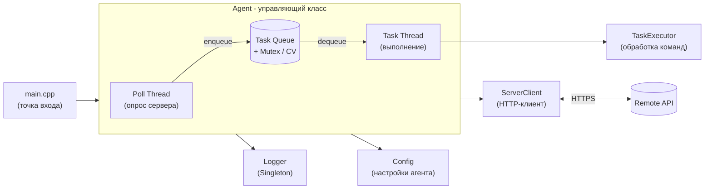

<div align="center">

# CardioAgent

**Кроссплатформенный автономный веб-агент на C++17**

[](https://en.cppreference.com/w/cpp/17)
[](https://cmake.org/)
[](https://www.openssl.org/)
[](https://github.com/ESemion/CardioAgent)

Агент автономно подключается к серверу управления, получает задачи и выполняет их в фоновом многопоточном режиме

</div>

---

## Содержание

- [О проекте](#о-проекте)
- [Возможности](#возможности)
- [Технологический стек](#технологический-стек)
- [Архитектура](#архитектура)
- [Быстрый старт](#быстрый-старт)
- [Настройка](#настройка)
- [API Reference](#api-reference)
- [Структура репозитория](#структура-репозитория)
- [Команда проекта](#команда-проекта)

---

## О проекте

**CardioAgent** — программный агент для автономного выполнения задач от центрального сервера управления. Проект реализован как кроссплатформенное решение с упором на **модульность**, **безопасность** и **надёжность** сетевого взаимодействия.

Агент самостоятельно регистрируется в системе, периодически опрашивает сервер на наличие заданий и выполняет их.

---

## Возможности

| Возможность                  | Описание |
|------------------------------|---|
| Кроссплатформенность [WIP]   | Работает на Windows, Linux и macOS без изменений исходного кода |
| Безопасное соединение        | Передача данных по HTTPS с использованием OpenSSL |
| Многопоточность              | Паттерн «Producer-Consumer»: опрос сервера и выполнение задач в раздельных потоках |
| Автоматическая регистрация   | Агент самостоятельно генерирует UID и получает `access_code` при первом запуске |
| Потокобезопасное логирование | Запись событий в файл и консоль без конфликтов между потоками |
| Экспоненциальный backoff     | Автоматическое увеличение интервала опроса при недоступности сервера |

---

## Технологический стек

| Компонент | Технология |
|---|---|
| Язык | C++17 |
| Система сборки | CMake ≥ 3.10 |
| HTTP/HTTPS клиент | [cpp-httplib](https://github.com/yhirose/cpp-httplib) |
| Шифрование | OpenSSL |
| Формат конфигурации | INI-файлы |

---

## Архитектура

### Схема компонентов



### Жизненный цикл запроса

```mermaid
sequenceDiagram
    participant A as Агент
    participant S as Сервер

    A->>+S: POST /api/wa_reg/ · {UID, descr}
    S-->>-A: {access_code, code_response: "0"}
    rect rgb(70, 70, 70)
    loop Периодический опрос (poll_interval)
        A->>S: POST /api/wa_task/ · {UID, access_code}
        rect rgb(10, 10, 10)
        alt Задание есть (code_responce: "1")
            S-->>+A: {task_code, session_id, status: "RUN"}
            A->>-A: TaskExecutor выполняет задачу
            A->>+S: POST /api/wa_result/ · multipart/form-data
            S-->>-A: {code_response: "0", msg: "ok"}
        else Задания нет (code_responce: "0")
            S-->>A: {status: "WAIT"}
        end
        end
    end
    end
```



### Модули

| Модуль | Описание                                                                 |
|---|--------------------------------------------------------------------------|
| `Agent` | Центральный класс: управляет жизненным циклом, потоками и очередью задач |
| `TaskExecutor` | Выполнение команд — анализ, работа с файлами и т.д.                      |
| `ServerClient` | Весь HTTP-транспорт: регистрация, опрос, загрузка результатов            |
| `Config` | Загрузка, хранение и автоматическое обновление настроек из INI-файла     |
| `Logger` | Синглтон-сервис для потокобезопасного ведения логов                      |

---

## Быстрый старт

### Требования

- Компилятор с поддержкой **C++17** — GCC, Clang или MSVC
- Библиотека **OpenSSL**
- **CMake** версии 3.10 или выше

### Сборка

```bash
# 1. Клонировать репозиторий
git clone https://github.com/ESemion/CardioAgent
cd CardioAgent

# 2. Собрать проект
mkdir build && cd build
cmake ..
cmake --build .
```

Исполняемый файл `cardioagent` появится в директории `build/`.

---

## Настройка и запуск

Скопируйте пример конфигурации и заполните обязательные поля:

```bash
cp config/agent.ini.example config/agent.ini
```

```ini
; ── Обязательные ────────────────────────────────────
server_url = https://your-server.com:9999

; ── Опциональные (есть значения по умолчанию) ───────
descr          =          ; описание агента (роль, сервер и т.д.)
poll_interval  =          ; интервал опроса, сек (по умолч. 10)
max_poll_interval =       ; макс. интервал при недоступности, сек (по умолч. 300)

; ── Автогенерируемые (заполняются программой) ───────
UID        =              ; генерируется при первом запуске
access_code =             ; выдаётся сервером при регистрации
```

> `UID` и `access_code` агент заполняет самостоятельно — вручную указывать не нужно.
---
Запустите исполняемый файл из корня директории проекта:
```bash
./build/cardioagent
```

---

## API Reference

Все запросы отправляются на базовый URL сервера управления. Ответы — JSON.

### POST `/api/wa_reg/` — Регистрация агента

Вызывается при первом запуске. Агент получает `access_code` для последующей аутентификации.

**Запрос:**
```json
{
    "UID": "007",
    "descr": "web-agent"
}
```

<details>
<summary>Ответы</summary>

**Успех (`code_responce: "0"`):**
```json
{
    "code_responce": "0",
    "msg": "Регистрация прошла успешно",
    "access_code": "594807-1ddb-36af-9616-d8ed2b9d"
}
```

**Агент уже зарегистрирован (`code_responce: "-3"`):**
```json
{
    "code_responce": "-3",
    "msg": "Такой агент уже зарегистрирован"
}
```
</details>

---

### POST `/api/wa_task/` — Запрос задания

Агент периодически опрашивает сервер. При наличии задания получает `task_code` и `session_id`.

**Запрос:**
```json
{
    "UID": "007",
    "descr": "web-agent",
    "access_code": "12588b-3d8c-718e-55f4-6ed26b57"
}
```

<details>
<summary>Ответы</summary>

**Задание есть (`code_responce: "1"`):**
```json
{
    "code_responce": "1",
    "task_code": "CONF",
    "options": "",
    "session_id": "bvLeD2gv-gtKH-IhmW-rsfd-Ejn1kyweawwi",
    "status": "RUN"
}
```

**Заданий нет (`code_responce: "0"`):**
```json
{
    "code_responce": "0",
    "status": "WAIT"
}
```

**Неверный код доступа (`code_responce: "-2"`):**
```json
{
    "code_responce": "-2",
    "msg": "неверный код доступа"
}
```
</details>

---

### POST `/api/wa_result/` — Отправка результата

Передаётся как `multipart/form-data`. Поддерживает загрузку файлов.

| Поле | Тип | Описание |
|---|---|---|
| `result_code` | `int` | `0` — успех, `< 0` — ошибка |
| `result` | JSON string | Метаданные результата (UID, session_id, message, кол-во файлов) |
| `file1`, `file2`, ... | file | Файлы-результаты выполнения задачи |

**Поле `result`:**
```json
{
    "UID": "007",
    "access_code": "12588b-3d8c-718e-55f4-6ed26b57",
    "message": "задание выполнено",
    "files": 3,
    "session_id": "ieLOLGzL-nyGP-mfG5-m3nI-eYL1CZzcaXz0"
}
```

<details>
<summary>Ответы</summary>

**Успех (`code_responce: "0"`):**
```json
{
    "code_responce": "0",
    "msg": "ok"
}
```

**Не все файлы загружены (`code_responce: "-3"`):**
```json
{
    "code_responce": "-3",
    "msg": "не все файлы загружены",
    "status": "ERROR"
}
```
</details>

---

## Структура репозитория

```
CardioAgent/
├── include/                # Заголовочные файлы (.h)
│   ├── Agent.h
│   ├── Config.h
│   ├── Logger.h
│   ├── ServerClient.h
│   ├── Task.h
│   └── TaskExecutor.h
├── src/                    # Реализация модулей (.cpp)
│   ├── main.cpp
│   ├── Agent.cpp
│   ├── Config.cpp
│   ├── Logger.cpp
│   ├── ServerClient.cpp
│   └── TaskExecutor.cpp
├── config/
│   └── agent.ini.example   # Шаблон конфигурации
├── lib/
│   └── cpp-httplib/        # Встроенная библиотека httplib
├── scripts/
│   └── install_service.bat # Установка как Windows-службы
├── logs/                   # Создаётся автоматически
├── temp/                   # Создаётся автоматически
└── CMakeLists.txt
```

---

## Команда проекта

Проект разрабатывается в рамках учебного цикла из **5 лабораторных работ**.

| Роль | Зона ответственности |
|---|---|
| Team-lead | Координация, планирование, взаимодействие с заказчиком |
| Проектировщик | ООП-модель и архитектура системы |
| Разработчики | Реализация кода и сетевого взаимодействия |
| Тестировщик | Функциональное и регрессионное тестирование |
| Технический писатель | Документация и отчёты |

---

<div align="center">
<sub>CardioAgent — итеративная разработка в рамках учебного курса</sub>
</div>
